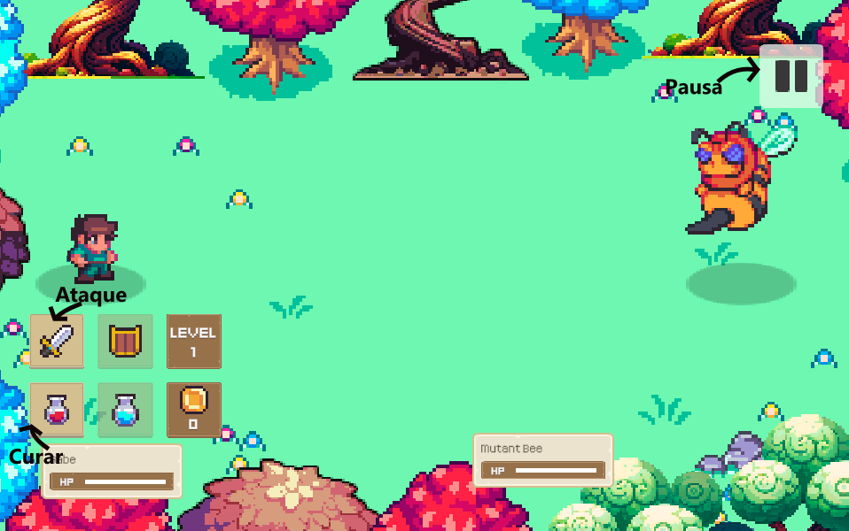
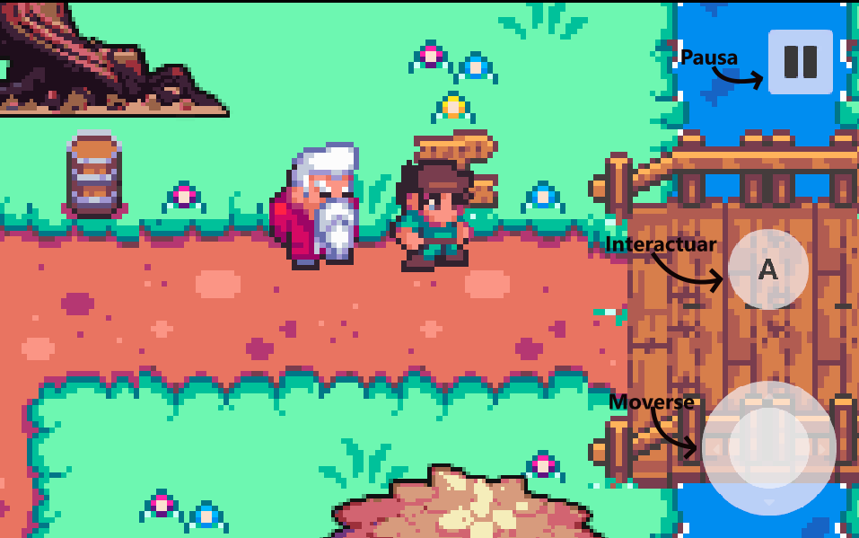
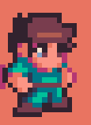
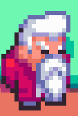
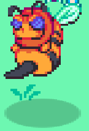
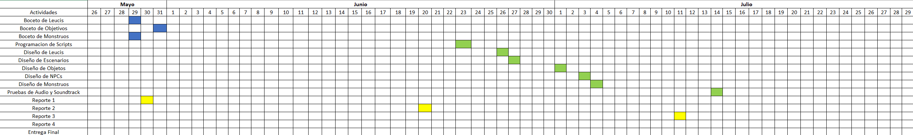
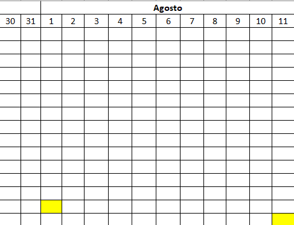

# Fantasy Adventure

**Desarrolladores:**

Equipo: Jose Manuel Puga Lopez 

[Añade una imagen de tu juego.]: #

## 🎮 Instrucciones de uso
- Unity versión: 2022.3.47f1
- Plataforma: PC
- Controles: W: Ir arriba, A: Ir a la izquierda, S: Ir abajo, D: Ir a la derecha, E: Interactuar con los NPC.

## Tabla de evaluación del equipo.

| Nombre | Colaboración | Comunicación | Responsabilidad
| ----------- | ----------- | ----------- | ----------- |
| Jose Manuel Puga Lopez | Programador | 10 | 9 |
| Jose Manuel Puga Lopez | Animador |  10 | 8 |
| Jose Manuel Puga Lopez | Tester |  10 | 10 |

## 1. Propósito de tu juego

### 1.1 Resumen del juego

El juego se centra en un aventurero humano quien pelea contra un grupo de abejas mutantes gigantes. 
El género del juego de fantasía RPG, su estilo grafico es en formato de pixel art, la ambientación del mundo es de fantasía medieval, las mecánicas serán las clásicas de los RPG (combate, puzles y acertijo), las inspiraciones para el juego son: Legend of Zelda y DnD, el jugador tendrá que mover al personaje y combatir contra los monstruos.

### 1.2 Resumen de la historia del juego

[Entre 80 y 100 palabras, manteniendo un enfoque claro en los puntos mencionados.]: # 
La historia se centra en Gabe un humano quien está en un bosque encantado y se enfrentara a unas abejas mutantes gigantes. Cuando termina de pelear contra las abejas, sale caminando por el bosque de fantasía donde se encuentra con un anciano dormido quien le dice que las entradas a los pueblos más próximos están bloqueadas, pero que si se desvía del camino encontrara un par de monstruos.

### 1.3 Objetivos del juego.
1- Acciones del Jugador: Ataque, Curar, Moverse e Interactuar con NPCs.  
2- Duración: Cerca de 10 minutos.  
3- Misiones: Derrotar tantas Anejas Mutantes como quiera el jugador.  
4- Escenarios: Bosque de Fantasia.  
5- Interacciones: Interactuar con el anciano del bosque.  
6- Sistema de elecciones: Elegir si quiere otro combate o no.  
7- Hablidades: ataque y curar.  

[Incluyan entre 6 y 10 puntos en la lista.]: # 

## 2. Jugabilidad

[Escribe un resumen de mínimo 150 palabras. Incluye al menos una imagen para ilustrar los controles.]: # 

## 3. Mundo del juego

[Es importante que su proyecto abarque al menos 4 hojas.]: # 
El juego se juega como los clásicos RPG, es decir sistema de combates, interacción con NPCs y caminos por donde puede viajar el jugador. El jugador atacara a las abejas con el boton de espada, se curara con el boton de pociones, puede poner pausa con el boton de pausa, se movera con el circulo en la esquina del juego y con las teclas AWSD y podra hablar con el NPC con la tecla E o con el boton que aparecera cuando se acerque al NPC.

## 4. Mecánicas del Juego

[Incluye ejemplos claros o diagramas.]: # 
Combate: Durante el juego el jugador se enfrentará a las abejas mutantes a quienes tendrá que vencer  

 
Interacción con NPC:  Para esto el jugador se acercará a los NPC y al hacerlo se aparecerá un botón para hablar con ellos.  

## 5. Personajes

[Es importante que incluyan al menos dos personajes principales completamente diseñados.]: # 
Gabe  
 

 
Puede moverse con las teclas ASWD, en la escena de combate ataca con el boton de espada, se cura con el boton de pocima e interactua con el NPC con la tecla E y con el boton A que aparece cuando se acerca a él.
 
Anciano 
 

 
Esta quieto a mitad del camino, cuando Gabe (el jugador) se le acerca puede hablar con el si el jugador pulsa la tecla E o la tecla A que aparece cuando esta a su lado.
 
Abeja Mutante 
 

 
Ataca a Gabe (el jugador) en la escena de combate, cuando es derrotado se le da al jugador una recompensa en monedas y el jugador puede elegir si ir a otro nivel de combate o terminar el combate e ir al bosque.

## 6. Plan del proyecto

[El plan debe incluir un diagrama de Gantt con el cronograma de desarrollo, ten en cuenta las fechas.]: # 

## 7. Bibliografía

[Cada fuente debe ser citada de manera correcta, siguiendo el formato APA.]: # 
Diseño avanzado de videojuegos RPG con Unity. (2021, 11 agosto). [Vídeo]. Domestika.  
https://www.domestika.org/es/courses/1761-diseno-avanzado-de-videojuegos-rpg-con-unity
