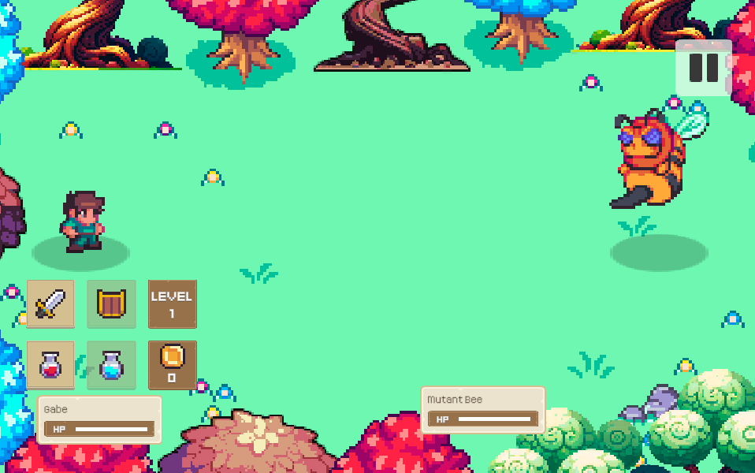
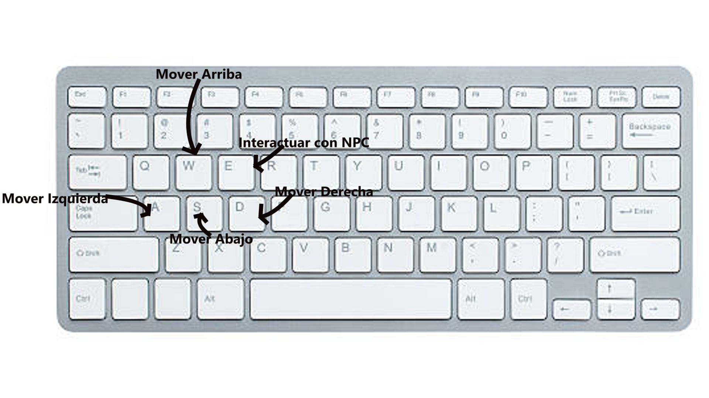

# Fantasy Adventure

**Desarrolladores:**

Equipo: Jose Manuel Puga Lopez 

[Añade una imagen de tu juego.]: #

## 🎮 Instrucciones de uso
- Unity versión: 2022.3.47f1
- Plataforma: PC
- Controles: W: Ir arriba, A: Ir a la izquierda, S: Ir abajo, D: Ir a la derecha, E: Interactuar con los NPC.

## Tabla de evaluación del equipo.

| Nombre | Colaboración | Comunicación | Responsabilidad
| ----------- | ----------- | ----------- | ----------- |
| Jose Manuel Puga Lopez | Programador | 10 | 9 |
| Paragraph | Text |  - | - |

## 1. Propósito de tu juego
El juego se centra en un aventurero humano quien pelea contra un grupo de abejas mutantes gigantes. 
El género del juego de fantasía RPG, su estilo grafico es en formato de pixel art, la ambientación del mundo es de fantasía medieval, las mecánicas serán las clásicas de los RPG (combate, puzles y acertijo), las inspiraciones para el juego son: Legend of Zelda y DnD, el jugador tendrá que mover al personaje, combatir a los monstruos.

### 1.1 Resumen del juego

[Escribe un resumen de mínimo 150 palabras.]: # 

### 1.2 Resumen de la historia del juego

[Entre 80 y 100 palabras, manteniendo un enfoque claro en los puntos mencionados.]: # 

### 1.3 Resumen de la historia del juego.

[Incluyan entre 6 y 10 puntos en la lista.]: # 

## 2. Jugabilidad

[Escribe un resumen de mínimo 150 palabras. Incluye al menos una imagen para ilustrar los controles.]: # 

## 3. Mundo del juego

[Es importante que su proyecto abarque al menos 4 hojas.]: # 

## 4. Mecánicas del Juego

[Incluye ejemplos claros o diagramas.]: # 

## 5. Personajes

[Es importante que incluyan al menos dos personajes principales completamente diseñados.]: # 

## 6. Plan del proyecto

[El plan debe incluir un diagrama de Gantt con el cronograma de desarrollo, ten en cuenta las fechas.]: # 

## 7. Bibliografía

[Cada fuente debe ser citada de manera correcta, siguiendo el formato APA.]: # 
